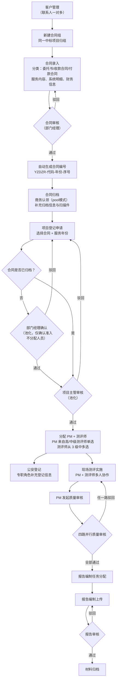

# 项目业务流程与模块职责

> 适用对象：首次接手该项目的开发、测试、产品同学
> 依据：当前代码结构、接口入口与现有设计文档整理
> 最后更新：2026-04-20

## 1. 项目定位

Nature 是一个围绕"等保测评项目"运行的内部业务平台。它不是单一的合同系统，也不是单一的测评工具，而是把客户、合同、项目、现场测评、质量审核、报告编制、材料归档串成一条完整业务链路。

从系统形态上看，它包含 4 个层次：

| 层次 | 位置 | 作用 |
|------|------|------|
| Web 管理端 | `packages/web` | 业务人员日常使用的后台系统 |
| API 服务端 | `packages/server` | 业务规则、权限控制、流程推进、数据读写 |
| 共享契约层 | `packages/shared` | 前后端共用的类型、常量、校验 |
| 离线终端预留层 | `packages/terminal` | 未来用于离线测评场景，目前仍是占位包 |

## 2. 核心业务对象

理解这个项目，先抓住下面几个核心对象：

| 业务对象 | 作用 | 关系 |
|------|------|------|
| 客户 `customer` | 客户主数据 | 一个客户可关联多个合同 |
| 客户联系人 `customer_contact` | 客户的联系人列表 | 一个客户有多个联系人，合同引用其中一个 |
| 合同组 `contract_group` | 将同一中标项目的多个合同归组 | 一个组包含多个合同（委托书/收款合同/付款合同） |
| 合同 `contract` | 商机成交后的合同载体 | 归属于某个合同组，合同下可配置多个系统明细和多个服务年份 |
| 项目登记 `project_register` | 将某份合同的某个服务年份转成实际执行项目 | 同一合同同一年份只能有一个有效项目 |
| 项目系统明细 `project_system_item` | 项目级被测系统清单 | 记录备案机关、等级、时间要求、备案证明等执行信息 |
| 项目成员 `project_member` | 项目范围内的角色关系 | 贯穿 PM、测评师、审核人、报告编制人 |
| 公安登记 `police_register` | 项目相关的公安登记信息 | 面向专职角色处理 |
| 现场测评 `on_site_assessment` | 项目实施阶段的测评数据 | 由 PM 和测评师协作完成 |
| 工作流实例 `wf_instance / wf_task` | 驱动审核、分派、回退和待办 | 是业务流转的编排层 |
| 报告与归档 | `compile_report_file`、`material_archive` 等 | 承接测评后的交付阶段 |

## 3. 两条主流程

系统本质上有两条相互衔接的主流程：

1. 合同流程：客户 -> 合同组 -> 合同录入 -> 合同审核 -> 合同归档
2. 项目流程：项目登记 -> 部门经理确认（仅合同未归档）-> 项目主管审核（分配 PM + 测评师）-> 公安登记 -> 现场测评 -> 质量审核 -> 报告编制 -> 材料归档

其中第二条项目流程是系统的核心主线，工作流引擎主要就是为它服务。

## 4. 业务流程图

### 4.1 流程解读

| 阶段 | 说明 |
|------|------|
| 客户与合同阶段 | 先沉淀客户（支持多联系人），再建合同组，组内录入合同（委托书/收款/付款），合同审核通过后自动生成编号和名称 |
| 项目立项阶段 | 从合同的具体服务年份发起项目登记。审核路径按合同归档状态分流：**合同未归档** → 部门经理先确认准入（不分配人员）→ 项目主管审核并分配 PM + 测评师；**合同已归档** → 直接由项目主管审核并分配。PM 候选来自高/中级测评师（单选），测评师候选来自 3 级（多选） |
| 项目执行阶段 | 公安登记和现场测评围绕项目展开，现场测评由项目组协同完成 |
| 质量控制阶段 | PM 发起质量审核，系统按回避规则自动选择审核人，并行完成多路审核 |
| 交付归档阶段 | 审核通过后进入报告编制、报告审核，最终完成材料归档 |

### 4.2 关键业务规则

| 规则 | 说明 |
|------|------|
| 合同组 | 同一中标项目的多个合同归组管理，列表以父子表格展示 |
| 合同分类 | 委托书、收款合同、付款合同，必填 |
| 合同编号生成 | 审核通过后自动生成，格式 `YZDZR-{服务内容代码}-{年份后两位}-{序号4位}`，按服务内容分开计数 |
| 合同文件验证 | 提交审核前必须上传合同文件和合同文件说明 |
| 跟单销售权限 | 跟单销售与创建者享有同等操作权限（编辑、提交、删除），审核通过/驳回同时通知两者 |
| 同合同多次登记 | 同一合同同一服务年份可以多次创建项目登记，支持分批登记；系统编号按合同+年份全局累加 |
| 项目登记审批分流 | 合同已归档 → 直接项目主管审核；合同未归档 → 先由部门经理确认准入，通过后再由项目主管审核分配 |
| 测评师分级 | 测评师角色细分为高级/中级/初级（`senior_assessor`/`middle_assessor`/`junior_assessor`），权限一致，仅影响 PM 候选：**PM 只能从高级/中级中选**，**测评师可从 3 级中多选** |
| PM 和测评师分配 | 统一由项目主管在 `DIRECTOR_REVIEW` 节点审核时分配（PM 单选 + 测评师多选），不再由部门经理分配、也不在公安登记阶段分配 |
| 现场测评协作 | PM 和测评师各自提交自己的部分，全员完成后节点才结束 |
| 质量审核回避 | 当前项目的 PM 和测评师不能担任该项目的质量审核人 |
| 报告退回机制 | 报告审核驳回后返回报告编制环节，不直接回到测评阶段 |

## 5. 角色体系

| 角色 | 角色代码 | 职责 |
|------|------|------|
| 超级管理员 | `super_admin` | 系统全局管理，拥有所有权限 |
| 销售 | `sales` | 客户管理、合同创建、项目登记（数据隔离：只看自己创建或跟单的） |
| 商务 | `commercial` | 合同归档（pool 认领），不可编辑财务信息 |
| 部门经理 | `dept_manager` | 合同审核、项目登记准入确认（合同未归档时）、最终审核 |
| 项目主管 | `project_director` | 项目登记审核，分配 PM 和测评师 |
| 高级测评师 | `senior_assessor` | 可担任 PM；可被选为测评师 |
| 中级测评师 | `middle_assessor` | 可担任 PM；可被选为测评师 |
| 初级测评师 | `junior_assessor` | 仅可被选为测评师 |
| 财务 | `finance` | 合同回款管理（独立菜单：财务管理 > 合同财务） |
| 公安登记专员 | `police_register` | 公安登记操作 |
| 技术审核员 | `tech_reviewer` | 整体技术审核 |
| 内容审核员（技术/管理/网络） | `content_reviewer_*` | 三路并行内容审核 |
| 报告编制人 | `report_writer` | 报告编制和提交 |
| 报告分配人 | `report_assigner` | 审核测评成果并分配编制任务 |
| 归档员 | `archiver` | 材料归档 |

> **注意**：原 `assessor` / `project_manager` 两个权限角色已废弃。
> - 项目经理身份由 `project_member.roleType='PM'` 判定（具体项目的指派关系），不再绑定权限角色
> - 测评师身份由 3 个分级角色 (`senior/middle/junior_assessor`) 承担，权限完全一致

## 6. 模块职责总览

### 6.1 后端模块职责

| 模块 | 职责 | 在主流程中的位置 |
|------|------|------|
| `auth` | 登录、获取当前用户信息、JWT 认证（支持 Header + Query Token） | 全局基础能力 |
| `user` | 用户管理、个人资料、密码、角色分配入口 | 系统管理 |
| `role` | 角色和权限点管理 | 系统管理 |
| `customer` | 客户档案维护、联系人一对多管理 | 业务起点 |
| `partner` | 合作方主数据维护 | 合同辅助数据 |
| `contract` | 合同组 CRUD、合同 CRUD、系统明细、提交审核、合同归档 | 合同流程核心 |
| `project` | 项目登记、项目系统明细、提交审核、项目成员分配 | 项目流程起点 |
| `workflow` | 启动流程、推进任务、查询待办、查询实例和任务详情 | 全流程编排核心 |
| `police` | 公安登记创建、编辑、完成 | 项目执行阶段 |
| `assessment` | 现场测评详情、进度、提交个人部分、发起质量审核、驳回后重提 | 项目执行与质量入口 |
| `review-opinion` | 审核意见历史、模板查询 | 质量审核辅助 |
| `report` | 报告列表、详情、报告提交 | 报告交付阶段 |
| `archive` | 归档列表、详情、归档提交 | 项目收尾阶段 |
| `file` | 通用文件上传、流式下载（后端代理，不暴露 S3 地址）、按业务对象查询附件 | 横切文件能力 |
| `assessment-file` | 现场测评相关文件管理 | 测评阶段专项文件 |
| `compile-file` | 报告编制相关文件管理 | 报告阶段专项文件 |
| `notification` | 通知列表、未读数、已读、删除 | 横切通知能力 |
| `recycle` | 回收站分页、恢复、永久删除 | 合同/项目删除治理 |

### 6.2 工作流相关模块怎么理解

这是项目里最关键、也最容易误解的一层。

| 模块/对象 | 职责 | 说明 |
|------|------|------|
| `workflow` 模块 | 通用流程引擎 | 不承载具体业务字段，只负责节点推进和任务状态 |
| `wf_definition / wf_node / wf_transition` | 流程定义层 | 定义节点类型、流转关系和规则 |
| `wf_instance` | 流程实例层 | 记录某个业务对象当前跑到哪个节点 |
| `wf_task` | 待办任务层 | 记录谁要做什么、是否完成 |
| `project.listener` | 监听流程事件并更新项目状态 | 部门经理 `DEPT_REVIEW` 驳回 → 项目状态置 REJECTED；项目主管 `DIRECTOR_REVIEW` 通过 → 生成系统编号 + 写入 PM 和测评师 |
| `report.listener` | 监听流程事件并更新报告编制关系 | 报告分配通过后写入报告编制人 |
| `notification.listener` | 监听流程事件并推送通知 | 审核通过/驳回/归档通知创建者和跟单销售 |

一句话理解：`workflow` 负责"流程怎么走"，业务模块负责"数据长什么样、页面怎么展示、业务规则怎么落地"。

### 6.3 前端模块职责

| 位置 | 职责 |
|------|------|
| `src/router` | 页面路由、登录校验、进入页面前的用户信息拉取 |
| `src/layouts` | 后台主布局、导航、通知入口、通用壳层 |
| `src/pages/customer` | 客户列表（展开行显示联系人）、详情、表单 |
| `src/pages/contract` | 合同组父子列表、合同表单、合同详情（含合同组关联合同展示） |
| `src/pages/finance` | 合同财务列表（父子表格，仅审核通过合同），编辑回款状态 |
| `src/pages/project` | 项目列表、表单（系统明细含备案区域级联）、详情（系统明细表格 + 关联合同附件区） |
| `src/pages/police` | 公安登记列表、详情（编辑含备案区域级联） |
| `src/pages/assessment` | 现场测评列表和项目执行详情 |
| `src/pages/report` | 报告列表、报告详情和提交入口 |
| `src/pages/archive` | 归档列表、归档详情 |
| `src/pages/system` | 用户、角色、合作方、回收站等系统管理页面。用户列表新增「证书编号」列（掩码展示，点击眼睛图标切换）和「角色」列，支持证书编号筛选 |
| `src/pages/workflow` | 任务详情页（TaskDetail），所有审批统一入口；`DEPT_REVIEW` 仅通过/驳回，`DIRECTOR_REVIEW` 显示 PM 单选（高/中级分组）+ 测评师多选（3 级分组） |
| `src/api` | Axios 请求封装（类型安全的泛型包装）和各业务 API 调用 |
| `src/stores/auth.ts` | 登录态、用户信息、权限缓存 |
| `src/directives/permission.ts` | 前端按钮级权限控制 |
| `src/utils/region-data.ts` | 行政区划级联数据（江苏省/扬州市优先） |
| `src/utils/status-map.ts` | 统一状态枚举中文标签和 Tag 颜色映射 |

## 7. 这个项目的职责边界怎么记

如果你要快速建立心智模型，可以按下面方式记：

| 关注点 | 主要模块 |
|------|------|
| "业务数据从哪来" | `customer`、`contract`（含合同组）、`project`、`police`、`assessment`、`report`、`archive` |
| "流程怎么推进" | `workflow` |
| "谁能看、谁能做" | `auth`、`user`、`role`、权限守卫、前端权限指令 |
| "项目里有哪些人" | `project_member` + `project.listener` + `report.listener` |
| "附件和交付物怎么存" | `file`（流式代理下载）、`assessment-file`、`compile-file` |
| "消息怎么到人" | `notification` + `notification.listener` |
| "删除后怎么恢复" | `recycle` |
| "财务怎么管" | `finance` 前端页面 + `contract.updateFinancial` 后端接口 |

## 8. 新人阅读代码的推荐顺序

如果是第一次接手，建议按下面顺序读代码：

1. `packages/web/src/router/index.ts` — 页面入口和路由结构
2. `packages/server/src/app.module.ts` — 模块装配
3. `packages/server/src/modules/contract/contract.service.ts` — 合同组 + 合同核心逻辑
4. `packages/server/src/modules/project/project.controller.ts` — 项目登记接口
5. `packages/server/src/modules/workflow/workflow.service.ts` — 工作流引擎
6. `packages/server/src/modules/project/project.listener.ts` — PM/测评师分配
7. `packages/server/src/modules/notification/notification.listener.ts` — 通知推送
8. `docs/BUSINESS_RULES.md` — 业务规则
9. `docs/ENTITY_FIELDS.md` — 实体字段说明

按这个顺序读，能够先看到页面入口，再看到模块装配，再看到业务主线，最后理解流程引擎如何驱动项目流转。
